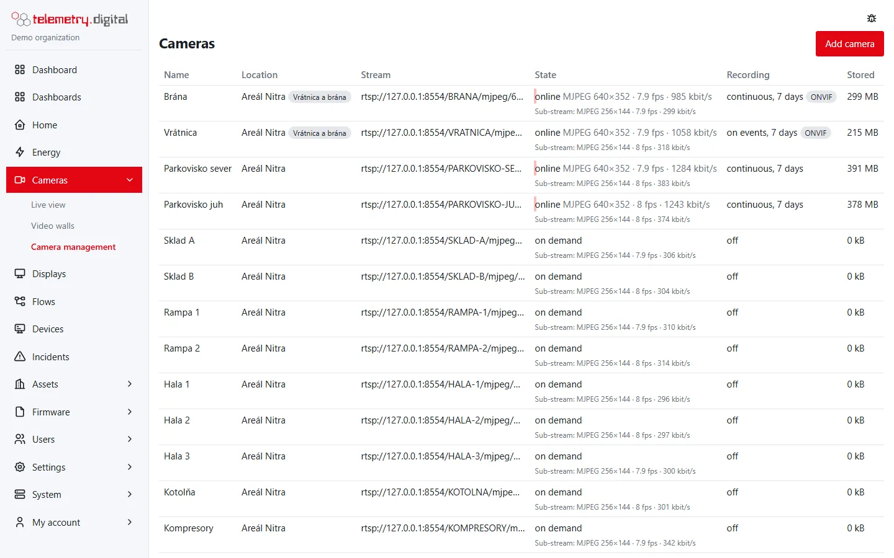

Each camera records **continuously**, **on events**, or not at all. The server records the camera's **main stream**
exactly as it arrives, into MP4 files that each start with a key frame, and indexes them in the database.

## Recording modes

| Mode | What is written | Notes |
|---|---|---|
| continuous | everything, all the time | events are stored too, as marks on the timeline |
| on events | only around the chosen kinds of events | pre-roll before the event, post-roll after it ends |
| off | nothing | live view only; the camera connects only while watched |

**Playback never stops recording.** Recording runs on the server by itself; watching, pausing or downloading only
reads the files.

### Recording on events

With *Recording: on events (motion, marks)* the dialog shows three more fields:

| Field | Default | Bounds | Meaning |
|---|:---:|:---:|---|
| Record before the event (s) | 10 | 0–60 | the last seconds are kept in memory, so the file starts before the event (from the nearest earlier key frame) |
| Record after the event (s) | 20 | 1–600 | recording goes on this long after the event ends |
| Events that start recording | motion, tampering, line crossing, intrusion, input, marks | any of 7 | ticked kinds start recording; *other* is off by default |

The seven event kinds are **motion**, **tampering**, **line crossing**, **intrusion**, **input** (digital inputs),
**marks** (from flows and people) and **other** (any other ONVIF event). Kinds that are not ticked are still stored
as events and shown on the timeline; they just do not start recording. See [Events and motion](events-and-motion.md).

A **mark** with a number of seconds (from the camera page, 60 s, or from a flow, 0–3600 s) records at least that
long from now on a camera that records on events and has *marks* ticked.

## Recorded files

- One file per **segment**: a new file starts at the first key frame after *Length of one recorded file* (default
  60 s, 10–600 s in [Video settings](settings.md)), when the picture size or codec changes, or after a gap of more
  than 10 seconds.
- Files are stored as `<storage_dir>/<camera id>/<date, UTC>/<time, UTC>.mp4`.
- The index of the open file (its end and size) is updated every 10 seconds, so what was just recorded can already be
  played back.
- Every file gets its **SHA-256** computed while it is written, for evidence (see [Evidence](evidence.md)).
- Sound is recorded with the picture when the camera's sound is on and *Sound recording* is *record it with the
  picture*; with *live only* the file has no sound track.

## Retention and disk limit

Retention runs **every minute**, in this order:

1. **Each camera's days** — files older than the camera's *Keep recordings (days)* (1–3650, default 7) are deleted,
   and so are its events older than that.
2. **The disk limit** — while all recordings together are larger than *Disk space for recordings* (default from
   `config.toml`, 50 GB), the oldest files of any camera are deleted first.

Recordings **held as evidence** are never deleted by either rule — see [Evidence](evidence.md). Removing a camera
keeps its recordings until its retention ends.



*The Recording and Stored columns of Camera management.*

*Camera management → Storage* shows the space recordings use, the limit and the percentage; *Settings → Disk space
for recordings* also shows the storage directory and how many camera-days at 2 Mbit/s fit.

## Where recordings are stored

The directory is set in `config.toml`; the disk limit there is only the default until an administrator saves
[Video settings](settings.md):

```toml
[video]
storage_dir = "/var/lib/ctrl32-telemetry/video"   # empty = "video" next to the report storage directory
max_disk_gb = 50                                  # default 50
```

If the directory cannot be written, recording is off and the server log says so.

## How much disk you need

Storage per day ≈ cameras × Mbit/s × 10.8 GB. One 2 Mbit/s camera needs about 21 GB a day.

| 64 cameras | Network | Disk per day | 14 days |
|---|:---:|:---:|:---:|
| H.265, 2 Mbit/s | 128 Mbit/s | ≈ 1.4 TB | ≈ 19 TB |
| H.264, 4 Mbit/s | 256 Mbit/s | ≈ 2.8 TB | ≈ 39 TB |

Sound adds to it, per camera and day: G.711 about 1.4 GB (it is stored uncompressed), AAC 0.2–0.7 GB. Choose *live
only* to hear sound without storing it.

## Disks

- Put the recordings on **their own disk or RAID of surveillance hard drives** (rated for continuous writing); keep
  the database on an SSD. SSDs wear out quickly under continuous recording.
- Files are written in large sequential pieces and the index is updated every 10 seconds per camera, so the database
  load stays negligible.
- An incident opens when the video disk is nearly full (default: below 5 % free), and one when a continuously
  recording camera sends video but nothing is written for 2 minutes — see [Video settings](settings.md).

## How many cameras one server takes

The server never decodes video, so processor load grows with the number of packets, not with resolution. Measured on
one virtual machine:

| Load | Result |
|---|---|
| 64 H.264 cameras at 25 fps, 297 Mbit/s, all recording (4-core VM) | all online, about 60 % of one core, 91 MB of memory; with 40 live viewers about 80 % of one core |
| 128 cameras, 593 Mbit/s, all recording | all online, about 70 % of one core, 153 MB; with 40 live viewers about 110 % of one core |

For 128 cameras plan a 1 Gbit network (a 10 Gbit uplink when the cameras run 4 Mbit/s or more) and a RAID of
surveillance drives that sustains the total write rate.

!!! note "Many cameras over UDP on Linux"
    The server asks Linux for a 4 MB receive buffer when allowed. With the common default of 208 KB, packets of large
    key frames can be dropped. For many or high-resolution cameras over UDP set `net.core.rmem_max=4194304` (and keep
    it in `/etc/sysctl.d/`), or switch the cameras to transport TCP.
