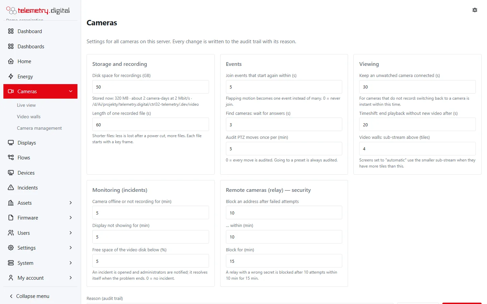

**Cameras → Settings** holds the server-wide video settings — they apply to all cameras and organizations on the
server. Anyone with `video.manage` sees them; only a user with `system.admin` changes them (for others the fields are
read-only). Every change needs a **reason** (up to 200 characters) and is audited (`video.settings`) with the old and
new values. The server checks every value against its bounds and refuses the first one outside them; **Default
values** fills in the defaults (you still save them with a reason).

## All settings

### Storage and recording

| Setting | Key | Default | Bounds | Meaning |
|---|---|:---:|:---:|---|
| Disk space for recordings (GB) | `max_disk_gb` | `config.toml` value (50) | 1 – 1 048 576 | the oldest recordings of all cameras are deleted beyond it |
| Length of one recorded file (s) | `segment_seconds` | 60 | 10–600 | shorter files lose less after a power cut, but make more files; each file starts with a key frame |

Below the disk limit the page shows what is stored now, about how many camera-days at 2 Mbit/s fit, and the storage
directory.

### Events

| Setting | Key | Default | Bounds | Meaning |
|---|---|:---:|:---:|---|
| Join events that start again within (s) | `event_merge_seconds` | 5 | 0–120 | flapping motion becomes one event; 0 = never join |
| Find cameras: wait for answers (s) | `discovery_seconds` | 3 | 1–15 | how long discovery waits for ONVIF answers |
| Audit PTZ moves once per (min) | `ptz_audit_minutes` | 5 | 0–60 | per user and camera; 0 = every move; going to a preset is always audited |

### Viewing

| Setting | Key | Default | Bounds | Meaning |
|---|---|:---:|:---:|---|
| Keep an unwatched camera connected (s) | `linger_seconds` | 30 | 0–600 | for cameras that do not record: switching back is instant within this time; applies as cameras reconnect |
| Timeshift: end playback without new video after (s) | `timeshift_seconds` | 20 | 5–300 | a playback following the recording to the present ends after this long without new video |
| Video walls: sub-stream above (tiles) | `wall_sub_stream_above` | 4 | 0–64 | wall screens set to *automatic* play the sub-stream when they have more tiles than this |

### Monitoring (incidents)

| Setting | Key | Default | Bounds | Meaning |
|---|---|:---:|:---:|---|
| Camera offline or not recording for (min) | `camera_offline_minutes` | 5 | 0–1440 | incident for a recording camera that is offline, or a continuously recording camera that sends video but writes nothing |
| Display not showing for (min) | `display_offline_minutes` | 5 | 0–1440 | incident for a paired display (with offline alerts on) that stopped reporting |
| Free space of the video disk below (%) | `disk_free_percent` | 5 | 0–50 | incident when the disk of the recordings is nearly full |

0 = no incident.

### Remote cameras (relay) — security

| Setting | Key | Default | Bounds | Meaning |
|---|---|:---:|:---:|---|
| Block an address after failed attempts | `push_max_fails` | 10 | 3–100 | failed relay authentications from one address … |
| … within (min) | `push_window_minutes` | 10 | 1–1440 | … within this window … |
| Block for (min) | `push_block_minutes` | 15 | 1–10 080 | … block the address this long |

The hint below repeats the rule in words. The rule covers the relay port and the camera-control channel of relays.

## Monitoring incidents

The server checks every minute and opens an **incident** in the incident log when a problem lasts the configured
time. Administrators are notified by e-mail and Web Push, and the incident resolves itself when the problem ends.

| Incident | Severity | Raised when |
|---|:---:|---|
| Camera … is offline | major | a camera that records (continuously or on events) is not online |
| Camera … is not recording | critical | a continuously recording camera is online but no file was written for 2 minutes (storage full or not writable?) |
| Display … is not showing | major | a paired display has not reported for over a minute, for the configured time |
| Video storage almost full | critical | free space of the recordings' disk is below the percentage; recording stops when the disk is full |

An incident closed by someone while the problem goes on is opened again after the configured time. Incidents of
removed or disabled cameras end. See [Alarms, notifications and incidents](../automation/alarms.md).

## The [video] section of config.toml

| Key | Default | Meaning |
|---|:---:|---|
| `storage_dir` | `video` next to the report storage directory | where recordings are stored |
| `max_disk_gb` | 50 | default of *Disk space for recordings* until it is saved on the Settings page |
| `push_listen` | empty (off) | the relay port, for example `":8322"` — see [Remote sites](remote-sites.md) |
| `push_tls_cert` | `http.tls_cert` | PEM certificate for the relay port |
| `push_tls_key` | `http.tls_key` | PEM key for the relay port |
| `push_host` | host of `http.base_url` | host name relays connect to |

Changes in `config.toml` take effect after a restart of the server. Values saved on the Settings page are stored in
the database and win over `max_disk_gb`.

## Per camera, per wall, per viewer

- **Per camera** (*Camera management → Edit*): addresses, transport, ONVIF, recording mode, pre- and post-roll, the
  event kinds that record, retention, sound, privacy masks, motion detection, camera group, order — see
  [Adding cameras](cameras.md).
- **Per video wall screen**: layout, cameras and stream (automatic, sub-stream or main stream) — see
  [Video walls](video-walls.md).
- **Per viewer** (remembered in the browser): tile size, layout, stream information, PTZ speed and whether the PTZ
  controls are shown.

## Network notes

- Keep cameras in a separate network reachable only from the server.
- Browsers receive video over a WebSocket at the same address as the web interface; a reverse proxy must pass
  WebSocket upgrades.
- ONVIF discovery uses multicast UDP port 3702 in the server's network.
- For many cameras over UDP on Linux, raise `net.core.rmem_max` or use transport TCP (see
  [Recording and storage](recording.md)).
