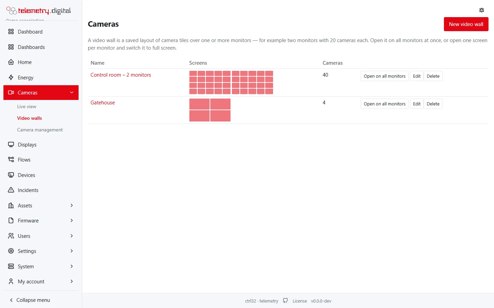
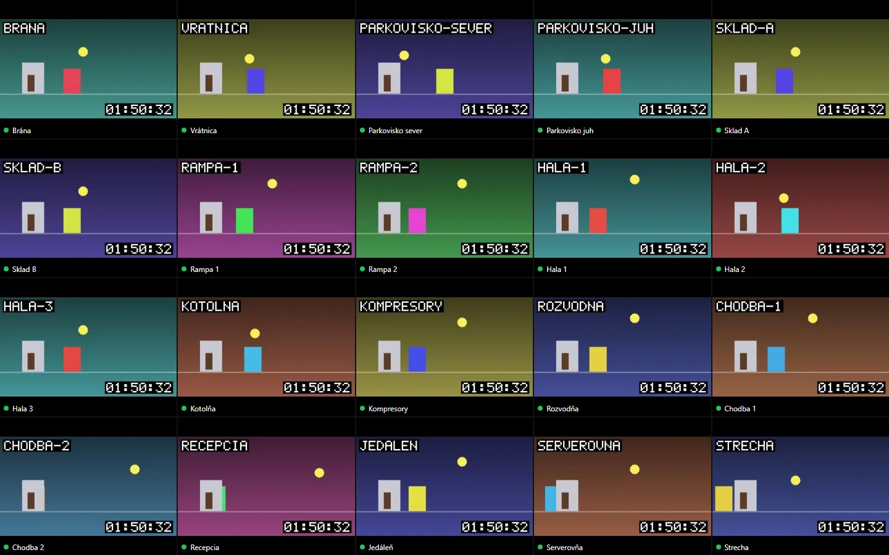
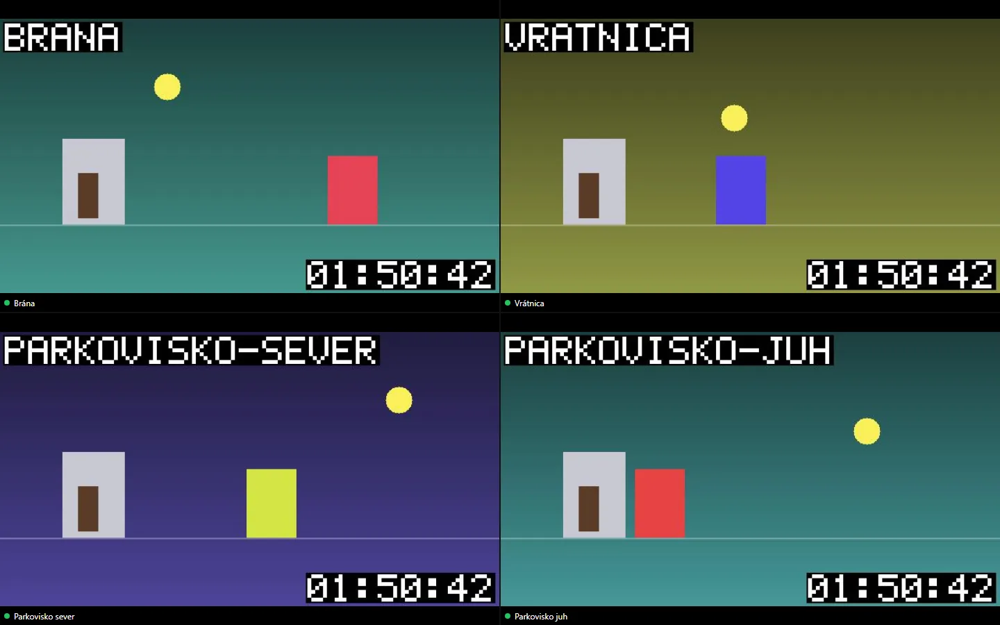
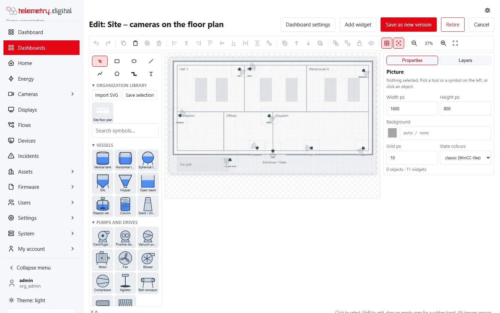
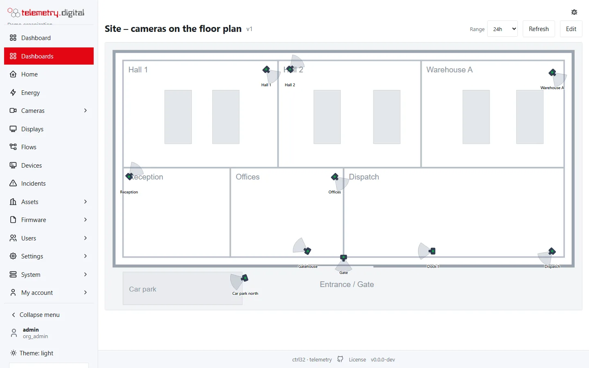

## Video walls

*Cameras → Video walls → New video wall*: a name and **1 to 8 screens** (monitors), each with a layout from 1 × 1 to
8 × 6 — for example 5 × 4 = 20 cameras per monitor — and a camera per tile. *Fill with all cameras* places them in
order.

- **Open on all monitors** opens one window per screen. In Chrome and Edge the browser asks once for permission to
  place windows and puts each on its own monitor; a click in each window switches it to full screen. In other
  browsers drag each window to its monitor and press F11.
- A single screen can be opened directly at `/video/walls/<id>?screen=1` — for example one PC per monitor.
- On the wall a click enlarges a camera to the whole monitor (main stream); Esc or another click returns. The toolbar
  hides after 3 seconds without mouse movement.
- Each screen chooses its stream: automatic, sub-stream or main stream. *Automatic* uses the sub-stream above a
  number of tiles (default 4).

*One screen of a control-room wall: 5 × 4 cameras.*

*A small 2 × 2 wall for a gatehouse.*

Walls never play sound. Changes of walls need a reason and are audited.

!!! tip "Walls that run day and night"
    For a wall without anyone signed in, pair the wall computer as a **display**: it shows wall screens and dashboards
    in turn, enlarges cameras with events and follows operators' commands. See [Displays](../dashboards/displays.md).

## Cameras on a floor plan

A floor plan or site map is a process screen with the plan as a background image and one pin per camera:

1. *Dashboards → New → Process picture*.
2. *Library → Import SVG* — for example a plan exported from a CAD drawing — and place it.
3. *Add widget → Process → Camera on a plan* for each camera: direction (0° = up, clockwise), field of view and
   reach draw the camera's view cone.

The pin is **green** when the camera is online, **red** when offline, and **orange, pulsing** while an event is in
progress. A click opens the live picture in a window (privacy masks apply) with a link to the camera page. Pins of
cameras outside your camera groups are not drawn. On a display the window closes by itself after a minute; public
shared dashboards show the pins without state.

*Cameras on a floor plan; the orange pins have an event in progress.*

## Camera widget

Any dashboard or process screen can show a live camera: *Add widget → Other → Camera*. Choose the camera, the stream
(sub-stream for small widgets), whether to show the name and the stream information, and whether a click opens the
camera page. The widget needs `video.view`. **Public shared dashboards never show cameras.**
