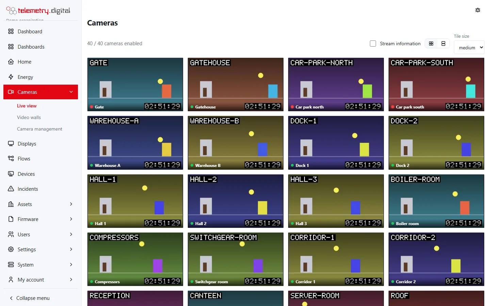
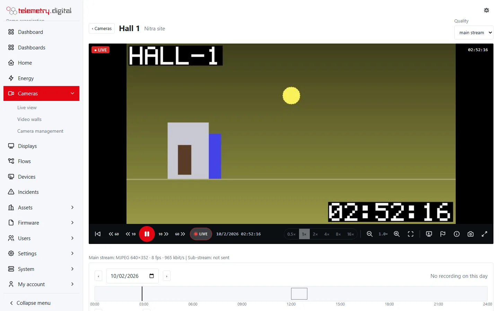
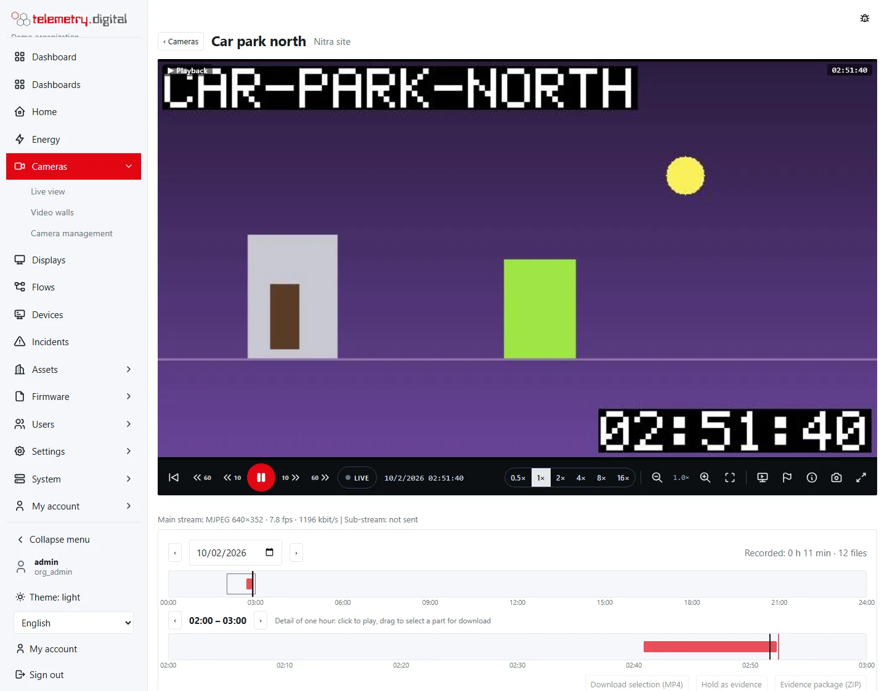
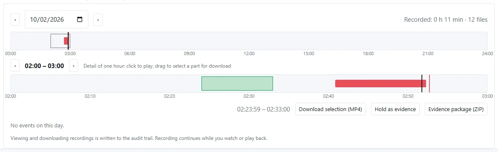

Live and recorded video play in the browser without plug-ins. H.264 and H.265 arrive as fragmented MP4 over a
WebSocket, MJPEG as single JPEG pictures.

## Live view

*Cameras → Live view* (`video.view`) shows every enabled camera you may see as a tile playing the **sub-stream** (the
main stream when the camera has none). The line above the tiles says how many cameras are enabled. Click a tile for
the camera page.

| Control | Options | Remembered |
|---|---|:---:|
| Stream information | codec, size, frames per second and kbit/s on each tile | in this browser |
| Layout | grid, or one camera per row | in this browser |
| Tile size | small, medium, large | in this browser |

- A tile with an event going on is outlined, with the event kinds as a label; the state is refreshed every 5 seconds.
- The status dot: recording, online, offline, or none while connecting.
- **Layout**: without your own choice, the layout follows the app (see [Phone app](phone-app.md)) and otherwise the
  screen width — one camera per row below 700 px.

## The camera page

One player for live and recorded video. The header shows the name and location and, in live mode for a camera with a
sub-stream, **Quality**: main stream (default) or sub-stream.

### The control bar

| Button | Key | What it does | Needs |
|---|:---:|---|:---:|
| Previous recording | Home | plays from the start of the previous recorded span (the previous day when there is none) | `video.playback` |
| 1 minute back | Shift + ← | jumps 60 s back | `video.playback` |
| 10 seconds back | ← | jumps 10 s back | `video.playback` |
| Pause / play | Space | freezes the picture; play continues from that moment out of the recording (timeshift) | — |
| 10 seconds forward | → | jumps 10 s forward (never past now) | `video.playback` |
| 1 minute forward | Shift + → | jumps 60 s forward | `video.playback` |
| LIVE | L | returns to the live picture | — |
| Speed | — | 0.5×, 1×, 2×, 4×, 8×, 16× for playback | `video.playback` |
| Zoom out, zoom in | − / + | digital zoom by 1.25× steps, 1× to 8× | — |
| Whole picture | 0 | resets the zoom (also a double click) | — |
| PTZ | — | shows or hides the PTZ controls | `video.ptz` |
| Show on display | — | sends this camera to a paired display for 2 minutes | `display.control` |
| Sound | S | sound on or off; listening is audited | `video.audio` |
| Mark | — | marks this moment with a label (records 60 s on cameras recording on events) | `video.view` |
| Stream information | I | codec, size, fps and bit rate as an overlay on the picture | — |
| Save picture | — | downloads the current picture as PNG | — |
| Full screen | F | the player fills the screen | — |

- **Digital zoom**: the mouse wheel or a two-finger pinch zooms at the pointer, dragging pans, a double click shows
  the whole picture. The zoom factor is shown on the picture.
- The badge on the picture shows **● LIVE**, **▶ Playback** (with the speed when not 1×) or **❚❚ Paused**; the clock
  shows the time of the picture.
- A jump to within 1.5 seconds of now switches to the live picture.
- A long press on the picture opens no browser menu.
- Below the player a line shows what arrives on the **main stream** and the **sub-stream** (or *on demand*, *not
  sent*), and *through the relay* for relayed cameras, updated every 3 seconds.

### Timeline

With `video.playback` a recording panel appears below the player:

- **Day**: ‹ and › for the previous and next day, or a date picker. The panel says how long was recorded that day and
  in how many files, or *No recording on this day*.
- **The day's timeline**: recorded spans, events (coloured by kind), held evidence, the current hour framed, *now*
  and the playing position. Click to play from that time.
- **The detail of one hour**: ‹ and › move by an hour. **Click** to play from a time; **drag** more than 5 seconds to
  select a part.
- **Events**: a list of the day's events (time, kind, label, duration or *going on*), up to 300; click one to play
  from the camera's pre-roll before it.
- **Held evidence** of the camera is listed with its title, case number, time and author, and *Release* for people
  with `video.evidence`.
- The panel reloads every 30 seconds while it shows today. Recorded spans less than 5 seconds apart are drawn as one.

*Playback from the recording, with the timeline and the hour detail.*

A link `/video/cameras/<id>?t=<milliseconds since 1970>` opens the camera playing from that moment.

## Timeshift

Pausing the live picture and pressing play continues from the paused moment out of the recording (with
`video.playback`) and follows the recording up to the present. A following playback ends after **Timeshift end**
(default 20 s) without new video. LIVE returns to the live picture. Playback never stops recording.

## Export a clip

Drag in the hour detail to select a part and choose **Download selection (MP4)**. The selection may be **at most one
hour** — longer selections show *(at most one hour)* and the button stays off. The file is named
`<camera>-<start time, UTC>.mp4` and plays in VLC or any player; the video is remuxed, never re-encoded. A change of
the camera's picture size or codec inside the range ends the file early.

- Exporting needs the permission `video.playback`; every playback and every export is written to the audit trail
  with the camera and the time range.
- Sound is in the export only when the camera's sound is on and you have `video.audio`.
- A camera with privacy masks can be exported only with `video.unmask` — see [Privacy](privacy.md).
- For the police, an insurer or a court, use a signed [evidence package](evidence.md) instead.

## Sound

The **Sound** button appears when the camera's sound is on and you have `video.audio`. Switching it on reconnects
the player to the **main stream** with sound (the Quality selector is hidden meanwhile); every listening is audited.
In playback sound plays only at 1× and only when the camera records its sound — for a *live only* camera the button
is off in playback. See [Privacy, sound and permissions](privacy.md#sound-is-off-by-default).

## Stream information

What actually arrives from the camera (or its relay): codec, picture size, frames per second and kbit/s (Mbit/s from
10 000 kbit/s), for the main and the sub-stream, updated every 3 seconds — below the player, or as an overlay with
the **ⓘ** button. The overlay choice is shared with the live view's *Stream information* switch.

## Browsers

- H.264 plays in every browser; **H.265** only where the operating system supports it (Safari, Edge or Chrome with
  hardware decoding). For tiles use an H.264 sub-stream.
- MJPEG plays everywhere.
- On iPhone live video needs iOS 17.1 or later.

If a reverse proxy sits in front of the server, it must pass WebSocket upgrades (Caddy, which the Linux installer
sets up, does by default).
