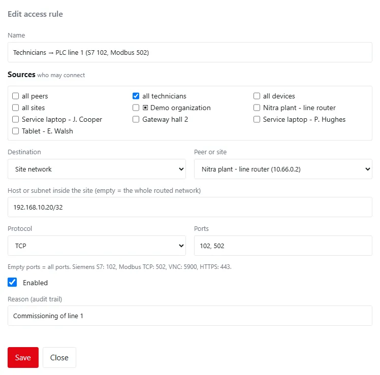
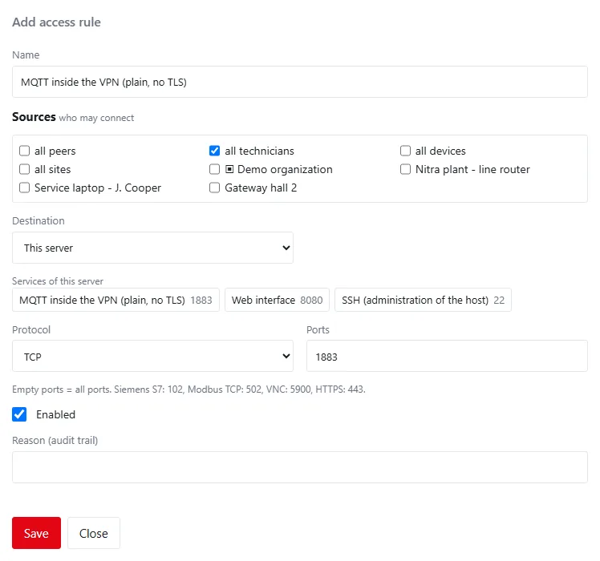
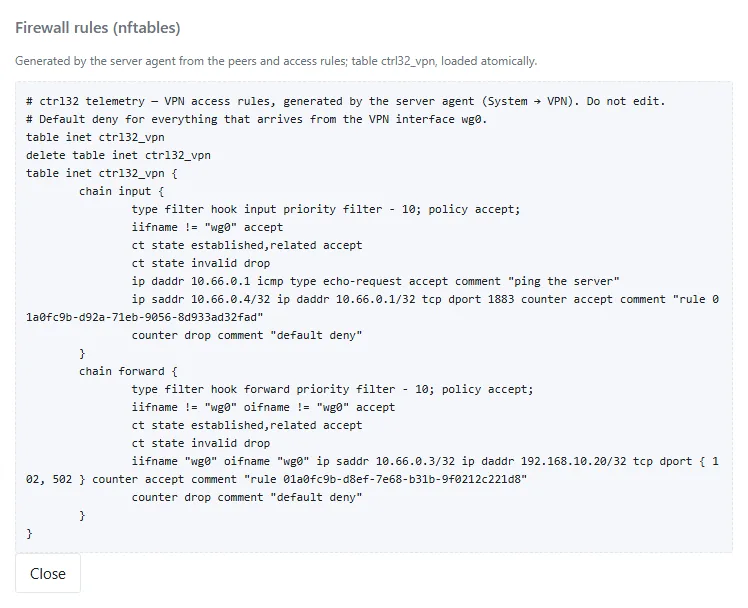

Everything that arrives from the VPN is **dropped unless an access rule allows it** — towards the server, towards
another peer and towards a site's network. A rule reads *sources → destination : protocol and ports*.

## What is always allowed

- **Replies** to connections that were allowed (a PLC answering a technician's request).
- **Ping of the server's VPN address**, for diagnostics.
- **The server itself** may reach every peer and every site network — for example the OPC UA or Modbus connectors
  that read a PLC at a site. Peers cannot reach the server back unless a rule allows it.

Nothing else: not the web interface, not MQTT, not SSH, not another peer. A peer also cannot pretend to be another
peer: the server accepts from each peer only its own address (and a site's routed subnets).

## Add a rule

Click **Add rule** (or **Edit** in a row). Every save asks for a reason; a change applies at once. A rule made by the
administrator of an organization belongs to the organization and has limits — see
[Rules of an organization](organizations-and-approvals.md#rules-of-an-organization).

| Field | Default | Allowed | Meaning |
|---|:---:|---|---|
| Name | — | 1–80 characters | for example *PLC programming at plant 1* |
| Sources | — | 1–20 entries | who may connect (see below) |
| Destination | This server | This server, Site network, Peer | where to |
| Peer or site | — | a peer, or a site for *Site network* | the destination peer or site |
| Host or subnet inside the site | — | an address or a network inside the site's routed subnets; empty = the whole routed network | *Site network* only; one host is safest |
| Protocol | TCP | TCP, UDP, ICMP (ping), Any | — |
| Ports | — | numbers 1–65535 and ranges, separated by commas, for example `102, 502, 8000-8100`; at most 20 entries, no overlaps; empty = all ports | TCP and UDP only |
| Enabled | on | — | a disabled rule is kept but allows nothing |
| Reason (audit trail) | — | up to 200 characters | required |

### Sources

| Source | Covers |
|---|---|
| all peers | every peer (server administrators only) |
| all technicians, all devices, all sites | every peer of that kind; a site includes its routed subnets (server administrators only) |
| an organization (▣) | every peer that belongs to the organization |
| a single peer | that peer; a site includes its routed subnets |

Only active peers count: a disabled or expired peer drops out of every rule at once.

### Destinations

| Destination | Reaches |
|---|---|
| This server | the server's own VPN address — its services (MQTT, the web interface, SSH) |
| Site network | the routed subnets of a site, or one host or subnet inside them, through the site's router — or through a customer server connected by an [uplink](uplink-hub.md), whose own uplink rules must allow it too |
| Peer | one peer's VPN address, for example a technician's laptop that a site must reach |

### Services of this server

With the destination *This server* the dialog offers the server's services as presets; a click fills in the
protocol, the ports and — when empty — the name.

| Preset | Port | Offered when |
|---|:---:|---|
| MQTT inside the VPN (plain, no TLS) | 1883 | always |
| Web interface | the web port, 443 | the web interface listens beyond the machine itself, or behind the HTTPS proxy |
| MQTT with TLS | 8883 | MQTT over TLS is configured |
| SSH (administration of the host) | 22 | on Linux, for server administrators only |

## Examples

| Goal | Sources | Destination | Protocol and ports |
|---|---|---|---|
| Program a Siemens S7 PLC with TIA Portal | all technicians | Site network *Nitra plant - line router*, host `192.168.10.20` | TCP `102` |
| Read and write a Modbus TCP device | all technicians | Site network, host of the device | TCP `502` |
| Siemens S7 and Modbus on the same PLC | all technicians | Site network, host `192.168.10.20` | TCP `102, 502` |
| Remote desktop of an HMI panel (VNC) | the peer *Service laptop - J. Cooper* | Site network, host of the HMI | TCP `5900` |
| A web HMI or a router's web page | all technicians | Site network, host of the HMI | TCP `443` |
| Ping the machines of a line | all technicians | Site network, the line's subnet | ICMP |
| Gateways send data without TLS | all devices | This server | TCP `1883` |
| An integrator works in the web interface over the tunnel | the integrator's peer | This server | TCP, the web port |

!!! tip "Least privilege"
    Prefer one host and the ports it needs over a whole network and all ports, a single peer over *all peers*, and
    time-limited technician peers for contractors. A rule for *Any* protocol to a whole site network gives the
    peer everything the site's router lets through.

## The rules table

| Column | Content |
|---|---|
| Name | the rule's name |
| Sources | the sources as chips |
| Destination | *this server*, or the peer or site with the host (*whole network* when empty) |
| Protocol and ports | the protocol and the ports, or *all ports* |
| State | *enabled* or *disabled* |

**Remove** asks for a reason; the access the rule allowed ends at once. Removing a peer also removes the rules
towards it and takes it out of other rules' sources.

## The generated firewall rules

**Firewall rules** on the *Server* card (server administrators only) shows what the server agent generated from the peers and rules: one
nftables table `ctrl32_vpn` with an `input` chain (traffic to the server) and a `forward` chain (traffic through the
server to peers and sites). Each accepted line carries the rule's identifier as a comment; the last line of each chain
drops everything else (*default deny*).

The table is replaced in one step on every change, after the agent checked it. It judges only traffic from and to the
VPN interface; other firewalls of the host (`ufw`, Docker's rules) cannot open what it drops. On a Windows server the
dialog is called *Access rules enforced by the server agent* and lists the same rules as the agent checks them.
