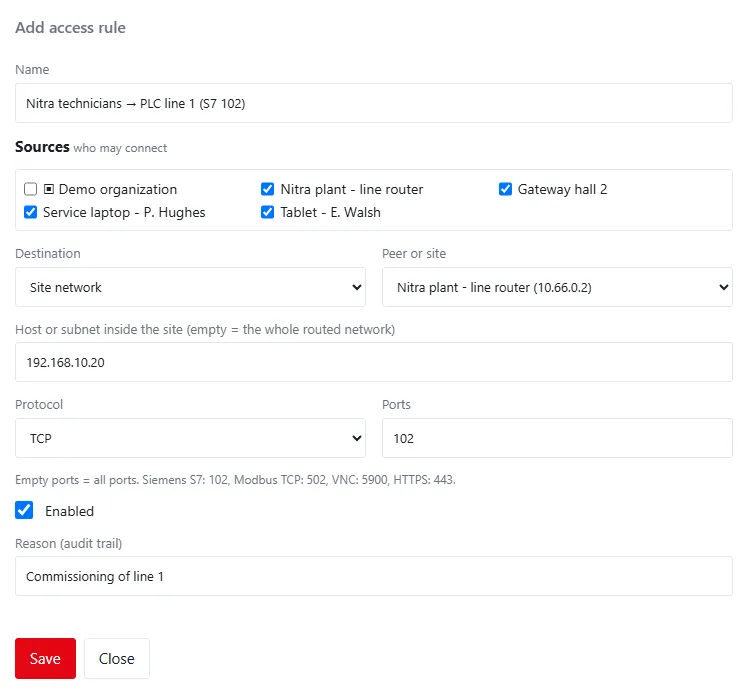
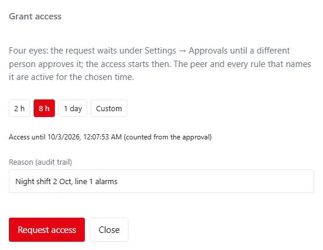
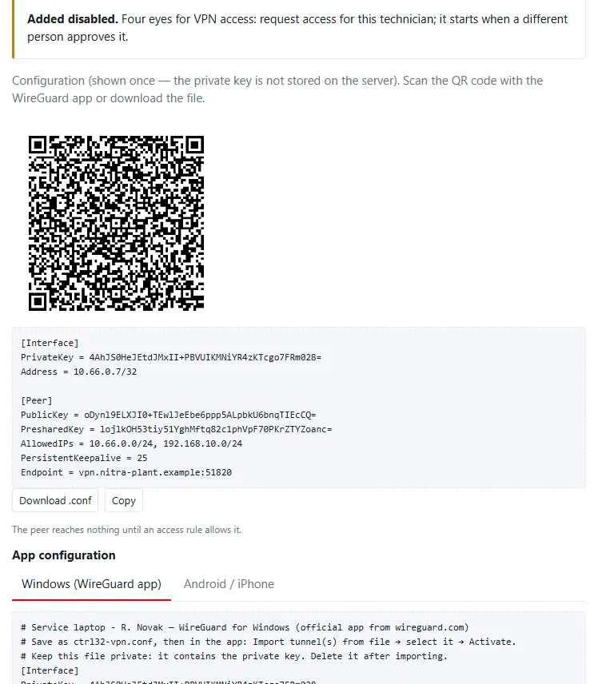

Three things decide who can reach a site through the VPN and when: **who manages** the peers and rules (the server
administrator or the administrator of an organization), **for how long** a peer is active (an access grant), and
**whether a second person** has to approve a technician's access (four eyes).

## Who manages the VPN

| Person | Permission | Manages |
|---|:---:|---|
| Server administrator (role `server_admin`) | `system.admin` | everything: the VPN server settings, every peer and rule, *Apply again*, the generated firewall rules |
| Administrator of an organization (role `org_admin`) | `vpn.manage` | the peers and access rules of the own organization, under **Settings → VPN** |

The administrator of an organization sees a note at the top of the page, no *Server settings*, no *Firewall rules*
and no *Apply again*. Peers and rules of other organizations and of the whole server do not appear at all.

### Peers of an organization

- A peer added by the organization's administrator belongs to the organization; it cannot be moved to another
  organization or to the whole server.
- The free limit of 5 peers counts every peer of the server, not per organization.

### Rules of an organization

An organization's rule is limited to the organization:

| Part | Allowed |
|---|---|
| Sources | the organization's own peers, or the whole organization (▣) |
| Destination: Site network or Peer | the organization's own sites and peers |
| Destination: This server | TCP to the services the server offers to the VPN (MQTT, the web interface, MQTT with TLS), or ICMP (ping) |

*All peers* and *all technicians, devices or sites* span every organization and are offered to server administrators
only. SSH of the host is never offered to an organization. A rule outside these limits is refused when saved.

Server administrators see every rule, including the rules of organizations, and can change or remove them.

## Access grants

**Grant access** on a peer enables it — and every rule that names it — for a limited time. When the time is up, the
peer is disabled again automatically.

| Field | Default | Allowed | Meaning |
|---|:---:|---|---|
| Length | 2 h | 2 h, 8 h, 1 day, or Custom (hours and minutes) | 15 minutes to 30 days |
| Reason (audit trail) | — | up to 200 characters | required, for example the service call number |

- The dialog shows when the access will end.
- A new grant replaces the one that is open.
- **Disable** ends a grant at once; clearing the expiry with **Edit** ends it too, and a new expiry moves its end.
- The peers table shows an open grant under the state: *access until …* and, after an approval, *approved by …*.
- Grants are time-limited access and require a licence.

## Four eyes for VPN access

With **Settings → Security policy → Four eyes for VPN access** a technician's access starts only after a **different
person** approves it. The switch is off by default and applies to the organization of the person who asks.

When it is on:

1. A new **technician** is added **disabled**. Its configuration is still shown once, so the laptop or phone can be
   prepared in advance.
2. **Request access** on the technician (the grant dialog) does not enable it: the request waits under **Settings →
   Approvals** with the kind *VPN access*, for example *VPN access for technician Service laptop - P. Hughes for 2
   hours*. The peer shows *awaiting approval* and who asked.
3. A different user with `vpn.manage` or `system.admin` approves or rejects it with a reason. On approval the access
   starts **then** and lasts the requested time; both names are kept with the grant and in the audit trail.
4. Enabling the technician directly or changing its expiry is refused; disabling stays immediate.

Devices and sites are not covered by the policy. AI assistants are never offered access grants.

!!! note "Approvals are per organization"
    A request waits in the Approvals of the organization of the person who asked. The approver needs the right to
    manage that peer: for a peer of the whole server that is a server administrator.

See [Approvals](../administration/settings-reference.md#approvals) and
[Security policy](../administration/settings-reference.md#security-policy) in the settings reference.

## Audit trail

| Entry | When |
|---|---|
| `vpn.grant` | access was granted (with the window, who asked and who approved) |
| `change_request.create` | a technician's access was requested under four eyes |
| `change_request.approve`, `change_request.reject` | the request was approved or rejected |
| `vpn.peer_expire` | the access ended (actor *system*, with the grant) |
| `organization.policy` | the four-eyes switch was changed |
