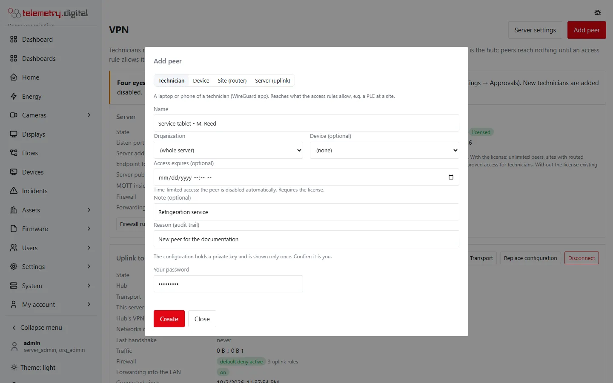
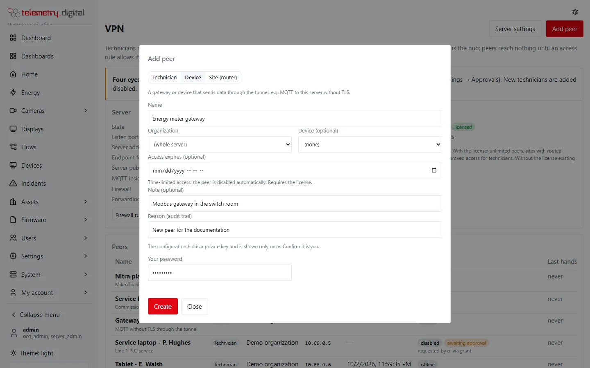
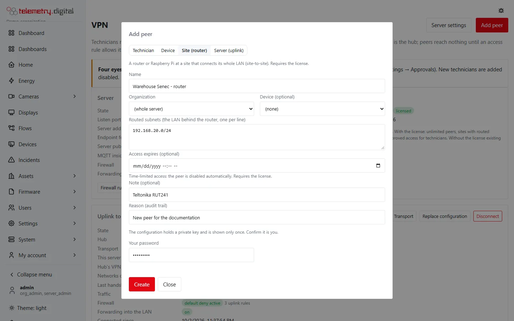
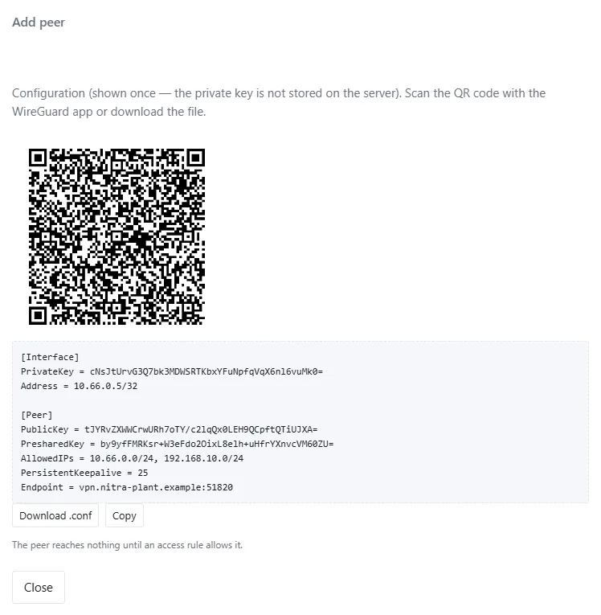
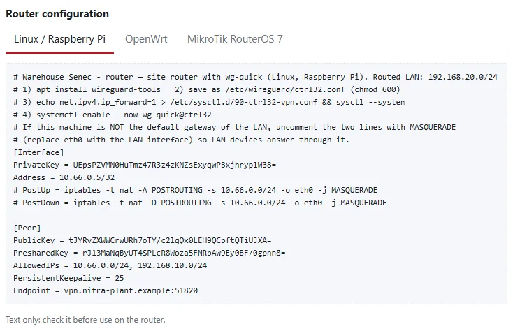
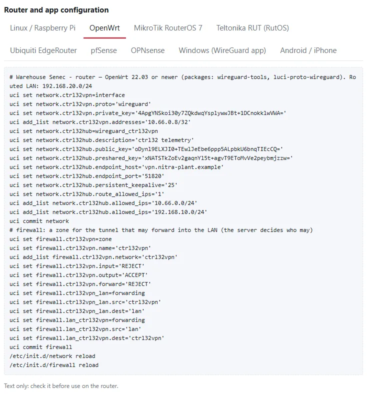
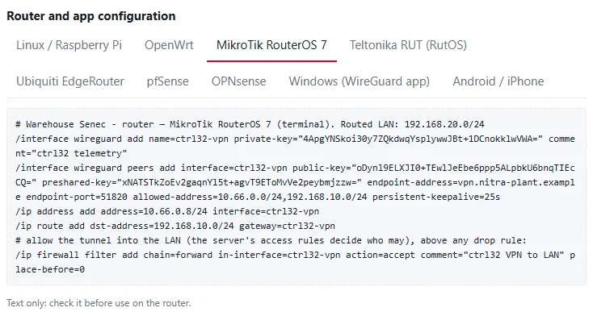

A **peer** is everything that connects to the server's VPN: a technician's laptop or phone, a device or gateway, or
a router that connects a whole site. Each peer has its own key pair and one fixed address in the VPN range.

## Peer kinds

| Kind | For | Routes into the tunnel | Licence |
|---|---|---|:---:|
| Technician | a laptop or phone with the WireGuard app; reaches what the access rules allow, for example a PLC at a site | the VPN range and the routed subnets of every site | free (up to 5 peers) |
| Device | a gateway or device that sends data through the tunnel, for example MQTT to this server without TLS | the VPN range only | free (up to 5 peers) |
| Site (router) | a router or Raspberry Pi at a site that connects its whole LAN (site-to-site) | the VPN range and the routed subnets of the other sites | requires a licence |

What a peer *routes* into the tunnel is only the way there: the server's [access rules](access-rules.md) decide
what it actually reaches.

## Add a peer

Click **Add peer**, choose the kind and fill in the form. The VPN server must be configured and enabled first.

| Field | Default | Allowed | Meaning |
|---|:---:|---|---|
| Kind | Technician | Technician, Device, Site (router) | see *Peer kinds*; it cannot be changed later |
| Name | — | 1–63 characters: letters, digits, space, dot, dash or underscore, starting with a letter or digit; unique | shown in the lists and in the configuration file name |
| Organization | (whole server) | an organization of the server | for your overview and as a rule source (*all peers of an organization*) |
| Device (optional) | (none) | a device of the server | links a device peer to the device it carries data for |
| Routed subnets | — | sites only: 1–16 IPv4 networks, one per line, from /8 to /32 | the LAN behind the router, for example `192.168.10.0/24` |
| Access expires (optional) | — | a date and time in the future | time-limited access: the peer is disabled automatically; requires a licence |
| Note (optional) | — | up to 200 characters | for example the router model or the purpose |
| Reason (audit trail) | — | up to 200 characters | required |
| Your password | — | your current password | confirms it is you: the configuration holds a private key |
| Authenticator code | — | the code of your authenticator app | only when you use two-factor sign-in |

The peer gets the **next free address** of the VPN range. Five failed password confirmations in a minute block
further attempts for a minute.

### Routed subnets of a site

- Enter the **network address**: `192.168.10.0/24`, not `192.168.10.1/24` — the dialog answers *… is not a network
  address; did you mean …?*
- A subnet may not overlap the VPN range, another subnet of the same site or a subnet of another site, and never a
  network of the server itself (that would cut the server off).
- A default route (`0.0.0.0/0`) and anything larger than /8 are refused, as are loopback, link-local and multicast
  ranges.

## The configuration — shown once

After **Create** the dialog shows the configuration **once**. The private key is not stored on the server: when the
configuration is lost, issue a new one with **Rotate key**.

- **QR code** — scan it with the WireGuard app on a phone or tablet.
- **Download .conf** — the file for the WireGuard app on Windows, macOS or Linux (`wg-quick`).
- **Copy** — copies the text.

The configuration contains the peer's private key and address, the server's public key, a preshared key (an extra
key per peer), what the peer routes into the tunnel (`AllowedIPs`), the endpoint and a keepalive of 25 seconds, so
peers behind NAT stay reachable.

!!! warning "Treat the configuration like a password"
    Anyone with the file can connect as that peer. Send it over a secure channel, never by plain e-mail, and rotate
    the key when a laptop or phone is lost.

## Router configuration of a site

For a site peer the dialog adds **Router configuration** with three texts that contain the same keys:

| Tab | For |
|---|---|
| Linux / Raspberry Pi | `wg-quick` on Debian, Ubuntu or Raspberry Pi OS: save as `/etc/wireguard/ctrl32.conf`, switch on IP forwarding, start `wg-quick@ctrl32` |
| OpenWrt | OpenWrt 22.03 or newer (packages `wireguard-tools`, `luci-proto-wireguard`): `uci` commands for the interface, the peer and a firewall zone that may forward into the LAN |
| MikroTik RouterOS 7 | terminal commands for the WireGuard interface, the peer, the address, routes to the other sites and a firewall rule that lets the tunnel into the LAN |

The texts are a starting point — **check them before use** on the router. For other routers with WireGuard, enter
the values of the `.conf` in the router's own WireGuard page.

### Where the site device sits

- **The router is the LAN's default gateway** — nothing else is needed: replies of the PLCs go back through it.
- **A Raspberry Pi beside the gateway** — the LAN devices do not know the way back into the VPN. Either uncomment the
  two `MASQUERADE` lines in the Linux template (replace `eth0` with the LAN interface), or add a route to the VPN
  range via the Raspberry Pi on the gateway.

The server itself does not translate addresses: VPN addresses stay visible in the site's logs.

!!! note "Profinet discovery does not cross the VPN"
    The VPN is routed, so layer-2 broadcasts — Profinet *accessible devices*, some vendors' search functions — do not
    reach the site. Enter the PLC's IP address by hand in the engineering tool.

## Manage peers

### The peers table

| Column | Content |
|---|---|
| Name | the name, the note and the linked device |
| Kind | Technician, Device or Site |
| Organization | the organization, or *(whole server)* |
| VPN address | the peer's address; for a site also its routed subnets |
| Expires | the expiry, or — |
| State | *online* (a handshake in the last 3 minutes), *offline*, *disabled* or *expired* |
| Last handshake | when the peer last connected, or *never* |
| Traffic | received ↓ and sent ↑ by the server |

### Actions

| Action | What it does | Needs |
|---|---|---|
| Edit | name, organization, routed subnets (sites), expiry and note | a reason; new routed subnets and setting an expiry require a licence |
| Disable | the peer loses access **at once**; its key is kept | a reason |
| Enable | the peer may connect again; an expired peer needs a new expiry or none first | a reason |
| Rotate key | issues a new key pair and shows the new configuration once; the old key stops working at once | a reason and your password |
| Remove | the peer loses access at once and its configuration becomes invalid; rules towards it are removed, and it is taken out of the sources of other rules (a rule left without sources is removed) | a reason |

Renaming, disabling, enabling, clearing an expiry, rotating and removing never need a licence.

### Time-limited access

With an expiry, the peer is **disabled automatically** at that time — for example a contractor who may reach a line
for one afternoon. The audit trail records it as `vpn.peer_expire` with the actor *system*. To give access again,
edit the peer, set a new expiry (or clear it) and enable it.
