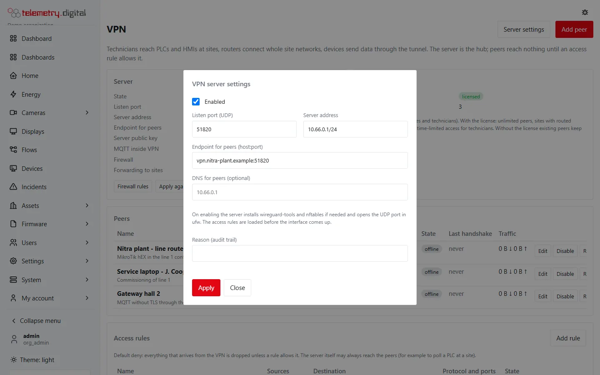

Server administrators manage the VPN on **System → VPN** (`/server/vpn`, permission `system.admin`); the earlier
address `/server/wireguard` leads there too. Only they change the server settings. The administrator of an
organization opens **Settings → VPN** (`/vpn`, permission `vpn.manage`) and manages the organization's own peers and
rules — see [Organizations, access grants and approvals](organizations-and-approvals.md).

## Before you start

- The server runs the server agent (the installer sets it up on Linux and Windows). Without the agent the page says
  *Server agent not configured*.
- Choose a **UDP port** (51820 by default) and make sure it reaches the server: open it in the cloud provider's
  firewall or forward it on your router. The server opens it in `ufw` (Linux) or in Windows Firewall itself.
- Choose a **VPN range** that is not used anywhere else — not on the server's own networks and not in any site's LAN.
  The default `10.66.0.1/24` leaves room for 253 peers. A hub for customer servers that connect by
  [uplink](uplink-hub.md) should use a range of its own, for example `10.99.0.1/16`.
- Decide the **endpoint**: the public name or address and port under which peers find the server, for example
  `vpn.example.com:51820`. When you leave it empty and the server has a domain, the domain is used.

## Enable the VPN server

1. Open **System → VPN** and click **Server settings**.
2. Tick **Enabled**, check the fields below and enter a reason.
3. Click **Apply**.

| Field | Default | Allowed | Meaning |
|---|:---:|---|---|
| Enabled | off | — | starts or stops the VPN server |
| Listen port (UDP) | 51820 | 1–65535 | the port peers connect to |
| Server address | `10.66.0.1/24` | an IPv4 address with a prefix from /8 to /30 | the server's own address inside the VPN; the prefix is the VPN range peers get their addresses from |
| Endpoint for peers (host:port) | the domain and the port | `host:port` | written into every peer's configuration |
| DNS for peers (optional) | — | an IP address | the name server written into every peer configuration |
| Reason (audit trail) | — | up to 200 characters | required |

On **Apply** the server agent on Linux:

- installs `wireguard-tools` and `nftables` if they are missing (Debian, Ubuntu);
- creates the server's key pair (the private key never leaves the agent);
- loads the firewall table **before** the interface comes up — if the table cannot be loaded, the interface does not
  start (fail closed);
- starts the WireGuard interface `wg0` and keeps it running after a reboot;
- opens the UDP port in `ufw` when `ufw` is active;
- lets the MQTT broker listen inside the VPN on the server address, port 1883, so devices can publish without TLS
  through the tunnel (the service restarts once when this changes).

Disabling stops the interface; peers and rules are kept.

## Windows servers

On Windows the server agent runs WireGuard itself, inside its own process: no driver, no extra program and no change
to Windows routing. Every packet from a peer passes the agent's check, which uses the same access rules as on Linux
(default deny, replies of allowed connections pass).

On **Apply** the agent on Windows creates the server's key pair, starts the VPN inside the agent and adds the inbound
Windows Firewall rule **ctrl32 WireGuard** for the UDP port (removed again when the VPN is disabled). The VPN page
shows *Runs: Windows: inside the server agent*, and **Firewall rules** shows the rules the agent enforces instead of
an nftables table.

| Item | On Windows |
|---|---|
| Services of the server (MQTT, the web interface) | reached through `127.0.0.1`: the service sees that address instead of the peer's; it must listen on the loopback address or on all addresses |
| UDP services of the server | not offered |
| SSH preset | not offered |
| Forwarding between peers and to sites | inside the agent |
| The server's own connections into sites (connectors reading a PLC at a site) | not available — use a Linux server for that |
| The agent stops | the VPN stops too (fail closed) |

!!! note "Not yet field-tested"
    The Windows VPN is tested on a development machine with real WireGuard clients; test it with your own peers
    before relying on it in production.

## The VPN page

### Server

| Row | Meaning |
|---|---|
| State | *running*, *enabled but not running* or *disabled* |
| Runs | *Linux: WireGuard and nftables* or *Windows: inside the server agent* |
| Listen port | the UDP port |
| Server address | the server's VPN address with the range |
| Endpoint for peers | where peers connect to |
| Server public key | the key every peer configuration contains |
| MQTT inside VPN | the plain MQTT address inside the tunnel, for example `mqtt://10.66.0.1:1883` |
| Firewall | *default deny active*, *not loaded* or *not applied* (with the error), and the number of access rules |
| Forwarding to sites | *on* while a rule needs traffic through the server to another peer or a site, otherwise *off* |

**Firewall rules** shows the generated firewall table (see [Access rules](access-rules.md#the-generated-firewall-rules)).
**Apply again** sends all peers and rules to the server agent once more (with a reason); the server also does this by
itself every five minutes and whenever a time-limited access ends. Both are for server administrators only.

When **Four eyes for VPN access** is on, a note at the top of the page says so (see
[Four eyes for VPN access](organizations-and-approvals.md#four-eyes-for-vpn-access)).

### Licence

Shows whether the server is **licensed** or uses the **free** VPN, and how many peers of the whole server are used — on the free VPN as
*used / 5*. Without a licence the card links to *System → License*. See
[Free and with a licence](index.md#free-and-with-a-licence).

### Peers and access rules

The **Peers** table lists every peer with its kind, organization, VPN address (and routed subnets), expiry, state,
last handshake and traffic; see [Peers](peers.md). The **Access rules** table lists the rules with their sources,
destination, protocol and ports; see [Access rules](access-rules.md). With no rules the table says *No access rules:
nothing is reachable from the VPN*.

## First steps after enabling

1. Add the peers — a site router first if technicians are to reach a site ([Peers](peers.md)), or a **Server
   (uplink)** for a telemetry.digital server without a public address ([Uplink to a hub](uplink-hub.md)).
2. Configure the router or the WireGuard app with the configuration shown once.
3. Add the access rules for exactly what each peer needs ([Access rules](access-rules.md)).
4. Check that the peer shows *online* and a recent *Last handshake*.
