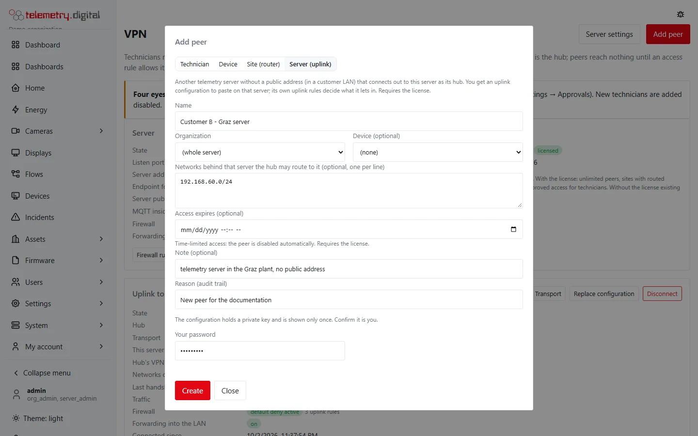
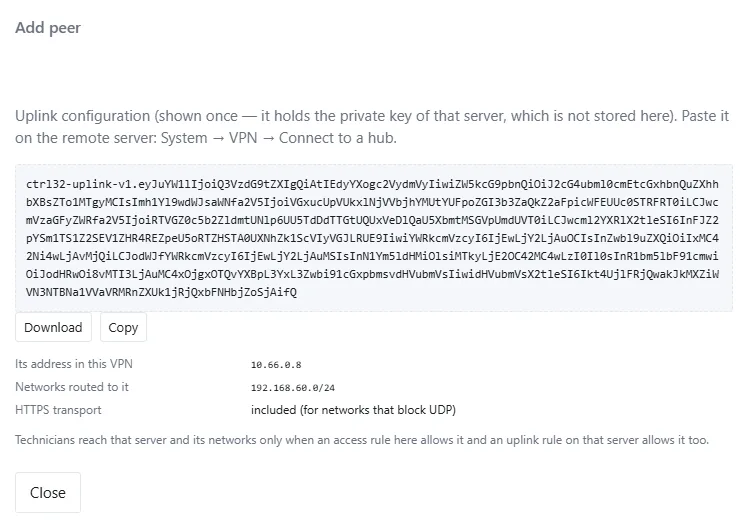
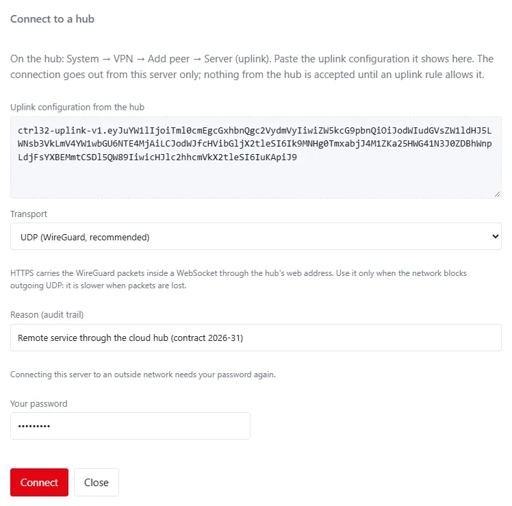
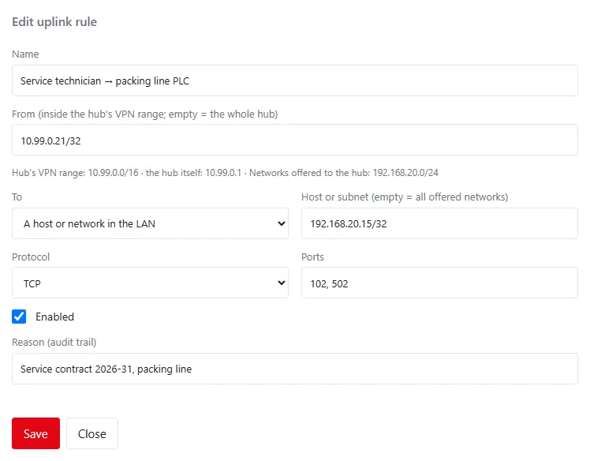
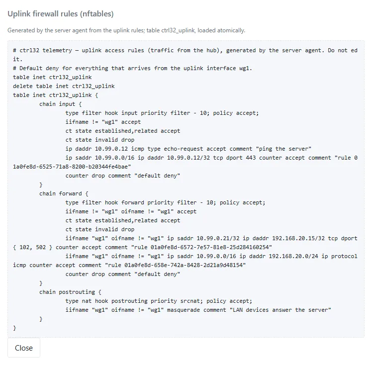
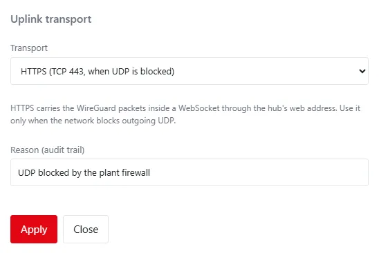

Most telemetry.digital servers at customers sit in a plant LAN **without a public address**: technicians cannot
connect to them as to a hub. The **uplink** solves this: the customer's server connects **out** to a hub — another
telemetry.digital server with a public address, for example your own server in the cloud — and technicians of that
hub reach the customer's server and its LAN, **only as the rules on both sides allow**.

## How it works

| Where | What you set up | Who decides |
|---|---|---|
| Hub (public address, for example in the cloud) | a peer of the kind **Server (uplink)** for each customer server, and access rules *technicians → that server or a host in its LAN* | the hub's administrators |
| Customer server (in the plant LAN) | **Connect to a hub** with the uplink configuration from the hub, and **uplink rules** *from the hub → this server or a host in the LAN* | the customer server's administrators |

A technician's connection passes two firewalls. The hub lets the technician towards the customer server only when one
of its access rules allows it; the customer server lets the hub's traffic in only when one of its uplink rules allows
it. Everything else is dropped on both sides.

Example: technician **10.99.0.21** of the hub programs PLC **192.168.50.20** at customer A.

1. On the hub: rule *technician → Customer A, host 192.168.50.20 : tcp 502*.
2. On customer A's server: uplink rule *from 10.99.0.21 → 192.168.50.20 : tcp 502*.
3. The technician connects to the hub with the WireGuard app and opens `192.168.50.20:502` in the engineering tool.

!!! info "Nothing is opened at the customer"
    The customer server only connects out — to the hub's UDP port, or with the HTTPS transport only to the hub's web
    address on port 443. No port forwarding, no public address and no change of the customer's router is needed.

## Requirements

- **The hub:** a telemetry.digital server with a public address, the VPN enabled (see [Set up the VPN](setup.md)) with
  an **endpoint for peers**, and a **licence** — a customer server is a site of the hub.
- **A VPN range of its own on the hub**, for example `10.99.0.1/16`. Customer servers usually use the default
  `10.66.0.1/24` for their own VPN; a hub range that overlaps it, the customer server's own networks or its sites is
  refused when connecting.
- **The customer server:** the server agent (Linux or Windows) and a server administrator. The customer server does
  not need a licence for the uplink, and its own VPN does not have to be enabled.
- For the **HTTPS transport** (networks that block outgoing UDP): the hub has an HTTPS address (its own domain).

## On the hub: add the customer server

1. Open **System → VPN** and click **Add peer**.
2. Choose **Server (uplink)**, enter a name (for example *Customer A - Brno server*), optionally the organization, and
   under **Networks behind that server** the LAN subnets the hub may route to it — one per line, for example
   `192.168.50.0/24`. Leave it empty when technicians need only the customer server itself.
3. Enter a reason and your password, and click **Create**.

The dialog shows the **uplink configuration once**: one line of text that starts with `ctrl32-uplink-v1.`. It holds
the private key of the customer server; the hub does not keep it. Copy it or download it and hand it over safely —
for example in person or in a password manager, never by plain e-mail.

| Shown | Meaning |
|---|---|
| Its address in this VPN | the customer server's address in the hub's VPN, for example `10.99.0.7`; technicians reach the customer server's own services there |
| Networks routed to it | the LAN subnets the hub routes to the customer server |
| HTTPS transport | *included* when the hub has an HTTPS address; otherwise only UDP is possible |

In the peer list the customer server appears with the kind **Server (uplink)**; *via HTTPS* when it uses the HTTPS
transport. **Rotate key** issues a new uplink configuration and stops the old one at once (including its HTTPS
transport); **Disable** and **Remove** end the connection at once.

### Access rules on the hub

Use the customer server like a site in the [access rules](access-rules.md):

| Goal | Destination | Example |
|---|---|---|
| The customer server's web interface | **Peer** — the uplink peer | *technicians → Customer A : tcp 443* |
| A PLC or HMI in the customer's LAN | **Site network** — the uplink peer, host or subnet inside its networks | *technician → Customer A 192.168.50.20 : tcp 502* |

Technicians' WireGuard configurations route the networks of every site, including those behind uplinks.

## On the customer server: connect to the hub

**System → VPN** shows the card **Uplink to a hub** to server administrators.

1. Click **Connect to a hub**.
2. Paste the uplink configuration from the hub.
3. Choose the **transport**: **UDP** (recommended) or **HTTPS** when the plant network blocks outgoing UDP.
4. Enter a reason and your password, and click **Connect**.

The server checks the configuration, refuses a hub range that overlaps its own networks, its own VPN range or its
sites, and brings the uplink up. **Nothing from the hub is accepted until an uplink rule allows it** — only ping of
the customer server's uplink address answers.

| Row | Meaning |
|---|---|
| State | **connected** — a handshake with the hub in the last 3 minutes; **waiting for the hub** — the uplink runs but the hub has not answered yet (wrong endpoint, the hub's UDP port closed, the uplink peer disabled on the hub, or UDP blocked: try HTTPS); **not running** — the interface is down |
| Runs | Linux: WireGuard and nftables; Windows: inside the server agent |
| Hub | the hub's endpoint |
| Transport | UDP, or HTTPS with the hub's web address and the tunnel's state |
| This server in the hub's VPN | the address technicians use for this server, and its name on the hub |
| Hub's VPN range | the technicians' addresses; the only range routed into the uplink |
| Networks offered to the hub | the LAN subnets the hub routes here |
| Firewall | *default deny active* and the number of uplink rules |
| Forwarding into the LAN | on while an uplink rule towards the LAN exists |

## Uplink rules

Uplink rules say what the hub may reach on the customer server. Click **Add uplink rule**.

| Field | Default | Allowed | Meaning |
|---|:---:|---|---|
| Name | — | 1–80 characters | shown in the list |
| From | the whole hub | an address or subnet inside the hub's VPN range, for example one technician `10.99.0.21` | who at the hub may connect |
| To | This server | *This server* or *A host or network in the LAN* | the customer server's uplink address, or a host or subnet of the networks offered to the hub |
| Host or subnet | all offered networks | inside the networks offered to the hub | LAN destinations only, for example one PLC |
| Protocol | TCP | TCP, UDP, ICMP (ping), Any | what the rule allows |
| Ports | all ports | `102, 502, 8000-8100` | TCP and UDP only |
| Enabled | on | — | a disabled rule stays in the list but opens nothing |
| Reason (audit trail) | — | up to 200 characters | required |

**Services of this server** fill in the ports of the web interface, MQTT in the tunnel, MQTT with TLS and SSH (Linux).
Rules can be prepared before the server is connected; they apply as soon as it is. Parts outside the connected hub's
ranges are left out.

!!! warning "Keep uplink rules narrow"
    The hub may be shared by many customers and technicians. Prefer one technician's address and one PLC with the
    ports it needs over *the whole hub → all offered networks*. Removing or disabling a rule ends the access at once.

### What the LAN sees

Connections into the LAN leave the customer server from **its own LAN address** (masquerade): PLCs and HMIs need no
route back to the hub, and in their logs the customer server is the client. Who connected is in the audit trail and
in the hub's logs. The customer server does not become a router for its LAN: devices in the LAN cannot open
connections towards the hub, and nothing else is forwarded.

### Generated rules

**Firewall rules** on the card shows what the server agent loaded: on Linux the nftables table `ctrl32_uplink`
(input to the uplink address, forwarding into the LAN, masquerade, default deny), on Windows the rules the agent
checks for every packet.

## HTTPS transport

When the plant network blocks outgoing UDP, the uplink can carry its WireGuard packets inside a WebSocket over the
hub's HTTPS address (TCP 443). Choose it when connecting or later with **Transport**.

- WireGuard still encrypts and authenticates every packet; the hub's web server only passes them on.
- The tunnel is opened only with the secret from the uplink configuration; *Rotate key* on the hub replaces it.
- It is slower when packets are lost (TCP inside TCP): good for maintenance access, not for large transfers.
- The hub needs an HTTPS address. Without it the uplink configuration offers UDP only.

## Key rotation, replacement and disconnecting

- **Rotate key** on the hub, then **Replace configuration** on the customer server with the new uplink configuration.
  The uplink rules stay.
- **Disconnect** on the customer server stops the uplink at once, removes its firewall table and deletes its keys.
  The uplink rules stay for a later connection.
- **Disable** or **Remove** on the hub ends the access from the hub's side at once.

## Linux and Windows

| Topic | Linux | Windows |
|---|---|---|
| Interface | `wg1` (WireGuard in the kernel) | inside the server agent |
| Firewall | nftables table `ctrl32_uplink` | the agent checks every packet |
| This server | its services on the uplink address; MQTT listens there too | its services through `127.0.0.1` |
| LAN hosts | TCP, UDP and ping as the rules allow, with masquerade | TCP only; the server opens the connection itself |
| Survives a restart | yes (the interface comes up with its table) | yes (the agent starts the uplink) |

## Safety first

- The uplink is **off** until a server administrator of the customer server connects it, with the password again and
  a reason. Administrators of an organization (`vpn.manage`) neither see nor change it, and AI assistants cannot
  connect it.
- **Default deny on both sides**; every change of a rule, of the transport, every connect, replacement and disconnect
  is written to the [audit trail](../administration/audit.md) (`vpn.uplink_*`).
- The uplink configuration holds a private key: it is shown once on the hub and kept only by the server agent of the
  customer server.

!!! warning "A hub reaches many customers"
    A hub with uplinks is a gateway into every connected customer network, within what the customers' uplink rules
    allow. Protect its administrator accounts with two-factor sign-in, keep its rules narrow and give technicians
    time-limited access (see [Organizations, access grants and approvals](organizations-and-approvals.md)).

## Troubleshooting

| Symptom | Check |
|---|---|
| *the hub's VPN range … overlaps this server's own VPN range* | the hub needs a range of its own (for example `10.99.0.1/16`); or change the customer server's own VPN range |
| *the hub's VPN range … overlaps the host network* | the customer's LAN uses the hub's range: the hub needs another range |
| State stays *waiting for the hub* | the hub's endpoint and UDP port, the uplink peer enabled on the hub, outgoing UDP allowed — otherwise switch to HTTPS |
| HTTPS tunnel *down* with *401* | the uplink peer was disabled, removed or its key rotated on the hub: replace the configuration |
| The technician reaches the customer server but not the PLC | a rule on **both** sides: the hub's rule towards the site network and the customer's uplink rule towards the LAN host |
| The PLC does not answer although both rules exist | the PLC itself (its own firewall, the right port), and on Windows that the protocol is TCP |

On a Linux customer server: `wg show wg1`, `nft list table inet ctrl32_uplink`, `ip route show dev wg1`.
